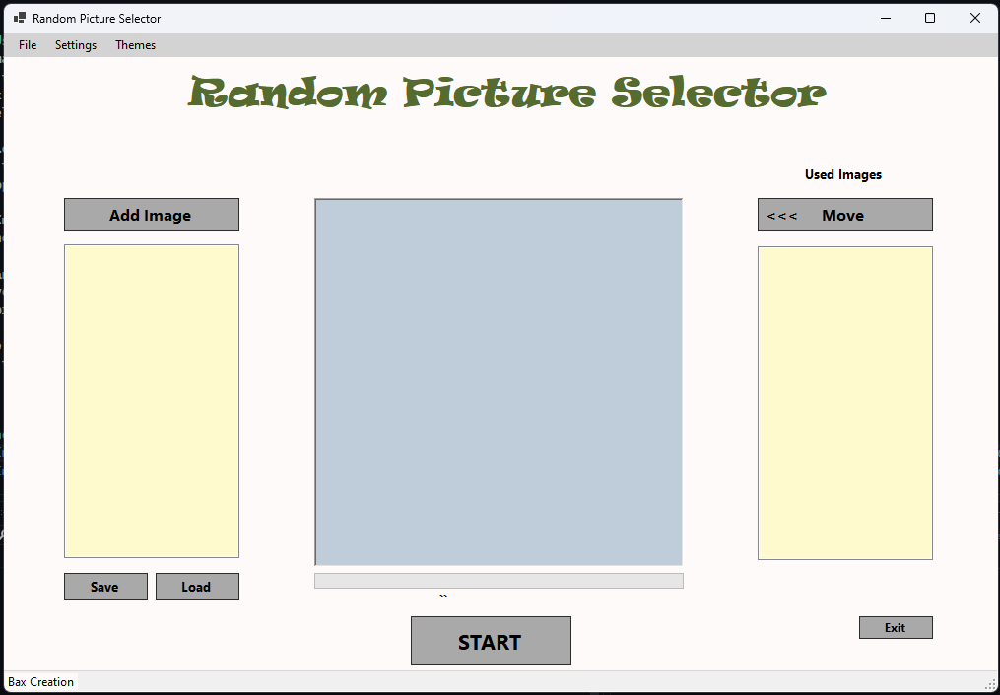
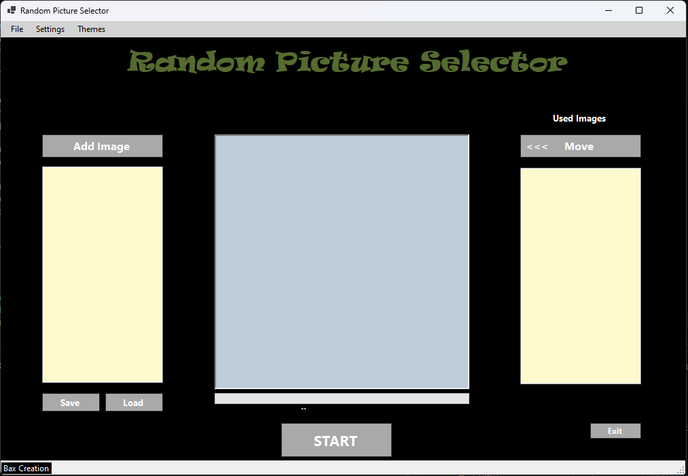
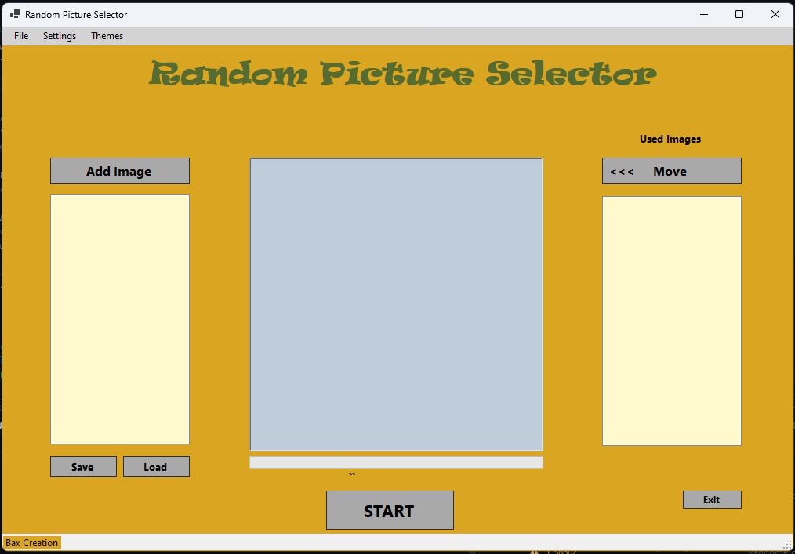
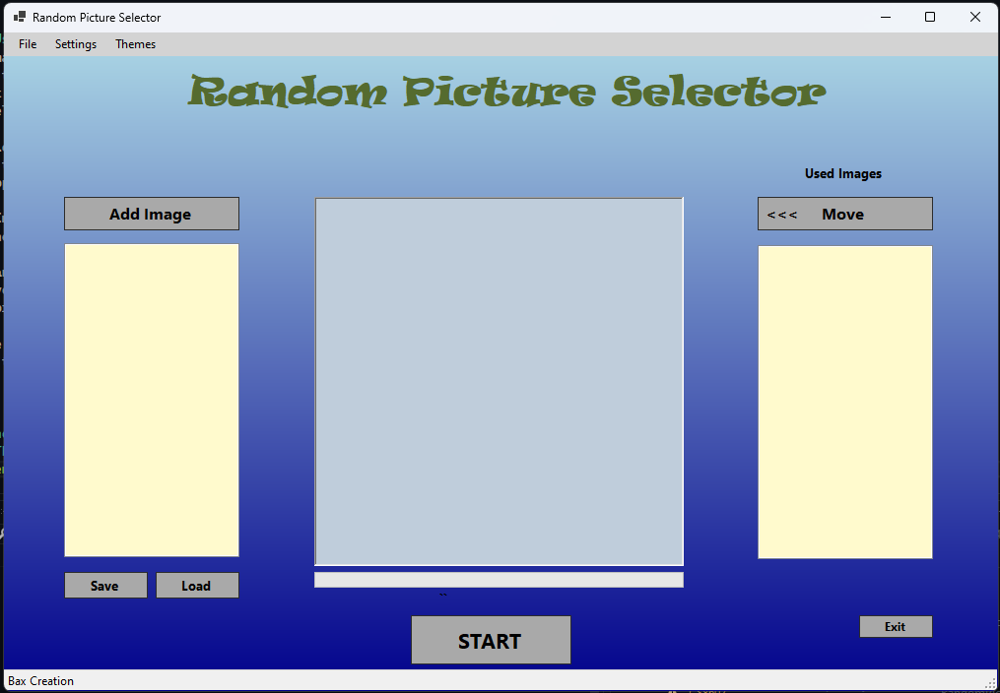
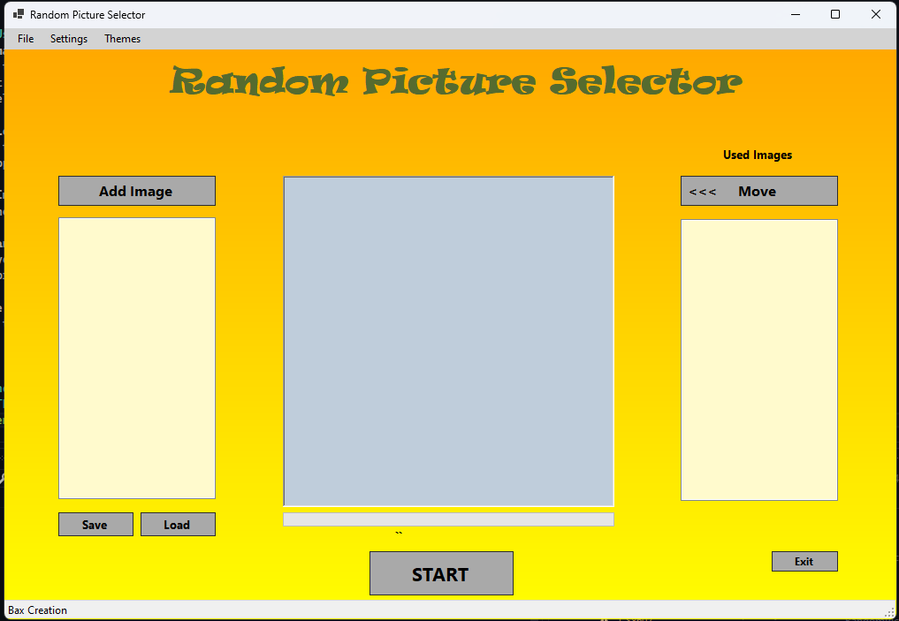
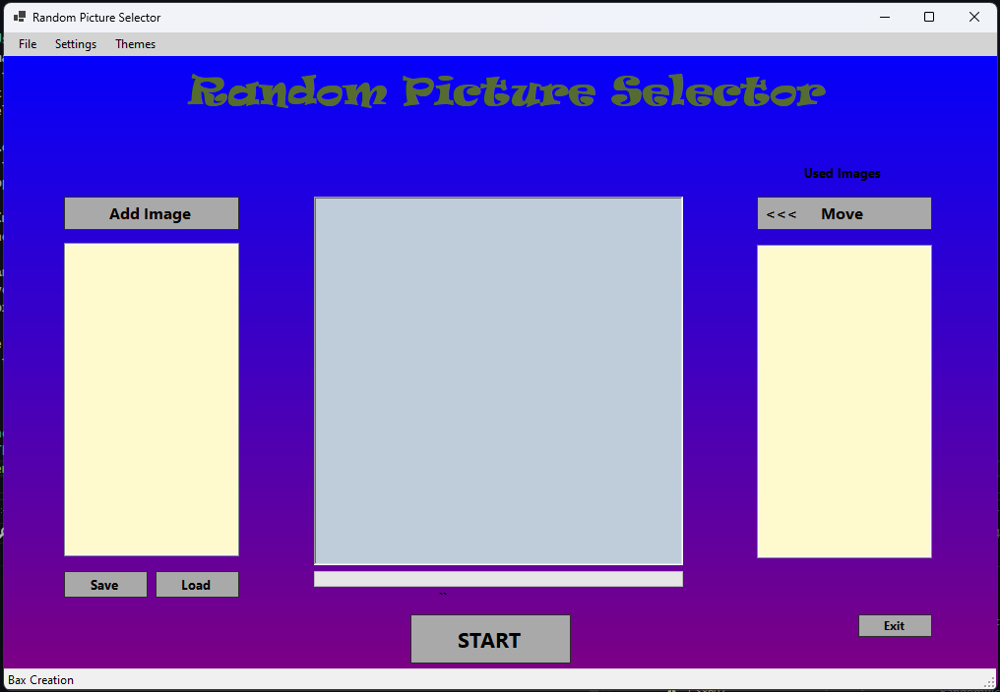

# Random Picture Selector

## Description
The **Random Picture Selector** is a Windows Forms application that allows users to add, 
shuffle, and display random images. 
It provides a clean and user-friendly interface with customizable themes, including gradient color options,
and allows users to manage their image lists with save and load functionality.

---

## Features
- **Add Images**: Add multiple images at once using the `Add Image` button.
- **Shuffle Images**: Randomly shuffle images with visual progress and display the final selected image.
- **Move Images**: Transfer images between `Inserted Images` and `Used Images` lists.
- **Themes**: 
  - Light Mode
  - Dark Mode
  - Custom Gradient Themes:
    - Light Blue to Dark Blue
    - Orange to Yellow
    - Blue to Purple
  - Default Theme
- **Save and Load**: Save your image lists to a text file and load them later.
- **Settings Persistence**: The application remembers your selected theme and gradient settings across sessions.
- **Drag and Drop**: Drag images directly into the application for easy adding.

---

## How to Use
1. **Add Images**:
   - Click the `Add Image` button.
   - Select the images you want to add (supports `.jpg`, `.jpeg`, `.png`, `.bmp`).
   - The selected images will appear in the `Inserted Images` list.
   
2. **Shuffle Images**:
   - Click the `START` button to shuffle images.
   - The application will shuffle trough the images and randomly select the final image.
   
3. **Move Images**:
   - Use the `Move` button to transfer images from the `Used Images` list back to the `Inserted Images` list.
   
4. **Save and Load**:
   - Save your image lists using the `Save` button.
   - Load previously saved image lists using the `Load` button.

5. **Change Theme**:
   - Go to the `Themes` menu and select your preferred theme or gradient.

---

## Screenshots

---

## Requirements
- **Operating System**: Windows
- **.NET 8**: 
- **Dependencies**:
  - System.Drawing
  - System.Windows.Forms
  - System.Text.Json

---

